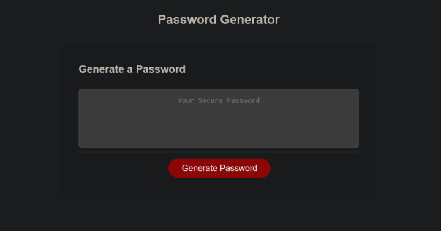

# Password-Generator

BootCamp Challenge - 03 JavaScript Challenge: Password Generator

## Description

To create an application that an employee can use to generate a random password based on criteria they've selected. This application will run in the browser, and will feature dynamically updated HTML and CSS powered by JavaScript code that I wrote.

## Process

To understand the objective of the challenge, I first read through the index.html, style.css and the README.md. I looked through past assignments done in class to help understand if-else statements.

Throughout the code there are comments to understand each section of the code for easy configuartion in the future.

## The look

## Installation

Project is uploaded to [Github](https://github.com/) at the following [repository.](https://github.com/mysteriousdj/Password-Generator)

Access to [Webpage.](https://mysteriousdj.github.io/Password-Generator/)